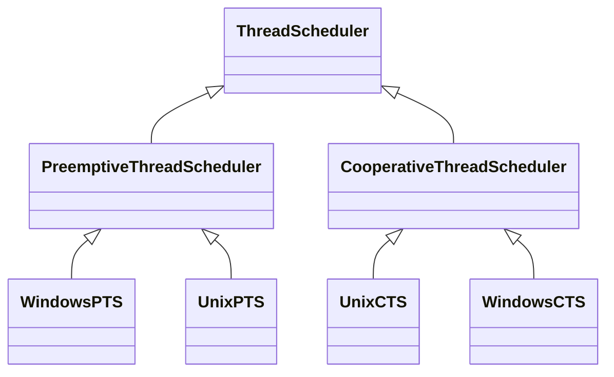
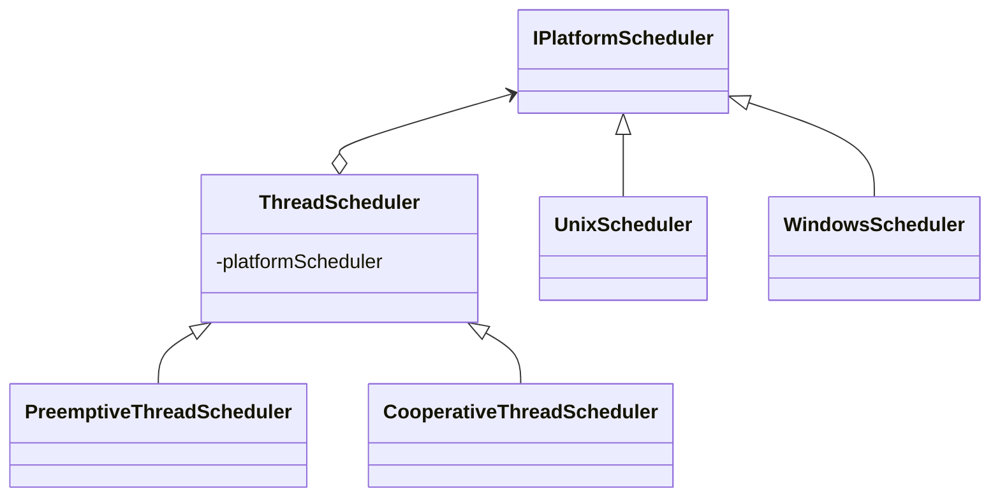

# C# Design Patterns

## Creational Patterns

Provide various object creation (_construction_) mechanisms, which
increase flexibility and reuse of existing code

- Explicit (_constructor_) vs. implicit (_DI, reflection, etc._)
- Wholesale (_single statement_) vs. piecewise (_step-by-step_)

### Builder

**Builder** lets you construct complex objects step by step. The pattern
allows you to produce different types and representations of an object
using the same construction code.

#### Motivation

- Some objects are simple and can be created in a single constructor call,
  other objects require a lot of ceremony to create
- Having an object with 10 constructor arguments is not productive,
  opt for **piecewise** construction instead
- **Builder** provides an API for constructing an object step-by-step

#### Summary

- A **builder** is a separate component for building an object
- Can either give builder a constructor or return it via a static function
- To make builder fluent, return `this`
- Different facets of an object can be built with different builders working
  in tandem via a base class

### Factory

**Factory Method** provides an interface for creating objects in a superclass,
but allows subclasses to alter the type of objects that will be created.

**Abstract Factory** lets you produce families of related objects without
specifying their concrete classes.

#### Motivation

- Object creation logic becomes too convoluted
- Constructor is not descriptive
  - Name mandated by name of containing type
  - Cannot overload with the same set of arguments with different names
  - Can turn into "optional parameter hell"
- Wholesale object creation can be outsourced to:
  - A separate function (**Factory Method**)
  - A separate class (**Factory**)
- Can create hierarchy of factories with **Abstract Factory** 

#### Summary

- A **factory** is a component responsible solely for the wholesale
  (not piecewise) creation of objects
- A factory method is a static method that creates objects
- A factory class can take care of object creation
- A factory can be external or reside inside the object as an inner class
- Hierarchies of factories can be used to create related objects

### Prototype

**Prototype** lets you copy existing objects without making your code
dependent on their classes.

#### Motivation

- Complicated objects (_e.g. cars_) aren't designed from scratch
- An existing (_partially or fully constructed_) design is a **prototype**
- We make a copy (_clone_) of the prototype and customise it
  - Requires 'deep copy' support
- We make the cloning convenient (_e.g. via a factory_)

#### Summary

- A **prototype** is a partially or fully initialized object that you copy
  (_clone_) and make use of
- To implement a prototype, partially construct an object and store it somewhere
- To clone the prototype
  - Implement your own deep copy functionality; or
  - Serialize and deserialize
- Customize the resulting cloned instance

### Singleton

**Singleton** lets you ensure that a class has only one instance, while
providing a global access point to this instance.

#### Motivation

- For some components it only makes sense to have one in the system:
  - Database repository
  - Object factory
- E.g. the constructor call is expensive
  - We only do it once
  - We provide everyone with the same instance
- Want to prevent anyone creating additional copies
- Need to take care of lazy instantiation and thread safety

#### Summary
- A **singleton** is a component which is only instantiated once
- Making a "safe" singleton is easy: construct a static `Lazy<T>` and
  return its `Value`
- Singletons are difficult to test
- Instead of directly using a singleton, consider depending on an
  abstraction (_e.g. an interface_)
- Consider defining singleton lifetime in a DI container

## Structural Patterns
Explain how to assemble objects and classes into larger structures,
while keeping these structures flexible and efficient

- Many patterns are wrappers that mimic the underlying class' interface
- Stress the importance of good API design

### Adapter

**Adapter** allows objects with incompatible interfaces to collaborate.

#### Motivation

- We cannot modify our gadgets to support every possible interface
- We use an adapter to give us the interface we require from the
  interface we have.

#### Summary

- Implementing an **adapter** is easy
- Determine the API you have and the API you need
- Create a component which aggregates (_has a reference to..._) the adaptee
- Intermediate representations can pile up: use caching and other optimizations

### Bridge

**Bridge** lets you split a large class or a set of closely related classes
into two separate hierarchies — abstraction and implementation — which can be
developed independently of each other.

#### Motivation

- Bridge prevents a 'Cartesian product' complexity explosion
- Example:
  - Base class `ThreadScheduler`
  - Can be preemptive or cooperative
  - Can run on Windows or Unix
  - End up with a 2x2 scenario: `WindowsPTS`, `UnixPTS`, `WindowsCTS`, `UnixCTS`
- Bridge pattern avoids the entity explosion

Before:

After:

#### Summary

- Decouple abstraction from implementation
- Both can exist as hierarchies
- A stronger form of encapsulation

### Composite

**Composite** lets you compose objects into tree structures and then work
with these structures as if they were individual objects.

#### Motivation

- Objects use other objects' fields/properties/members through inheritance
  and composition
- Composition lets us make compound objects
  - E.g. a mathematical expression composed of simple expressions; or
  - A grouping of shapes that consists of several shapes
- The composite design pattern is used to treat both single (_scalar_)
  and composite objects uniformly
  - i.e. `Foo` and `Collection<Foo>` have common APIs

#### Summary

- Objects can use other objects via inheritance/composition
- Some composed and singular objects need similar/identical behaviours
- The **composite** design pattern lets us treat both types of objects
  uniformly
- C# has special support for the _enumeration_ concept
- A single object can masquerade as a collection with `yield return this;`

### Decorator

**Decorator** lets you attach new behaviors to objects by placing these 
objects inside special wrapper objects that contain the behaviour.

#### Motivation

- Want to augment an object with additional functionality
- Do not want to rewrite or alter existing code (_Open-Closed Principle_)
- Want to keep new functionality separate (_Single Responsibility Principle_)
- Need to be able to interact with existing structures
- Two options:
  - Inherit from required object if possible; some objects are sealed
  - Build a **decorator** which simply references the decorated object(s)

#### Summary

- **Decorator** facilitates the addition of behaviours to individual objects
  without inheriting from them.

## Behavioural Patterns

Concerned with algorithms and the assignment of responsibilities
between objects

- All different; no central theme
- Unique in their approach to solving specific problems